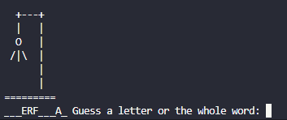

# Hangman Game

This is a simple command-line Hangman game written in Python.

## Features

### Existing Features

- __Random Word Selection__ - The game will randomly select a word from the word bank and display it as a series of underscores.

- __Guessing__ - You can guess a letter or the whole word by typing it in and pressing enter. If you guess correctly, the letter(s) will be revealed. If you guess incorrectly, a part of the hangman will be drawn.

  
- __Hangman ASCII Art__ - A visual representation of hangman using ASCII art is displayed as you make incorrect guesses.
- __Attempts__ - You have 7 attempts to guess the word before the hangman is fully drawn and you lose the game.

## How to Play

1. Run the script in a Python environment.
2. Enter your name when prompted.
3. Start guessing letters or the whole word.

## Requirements

- Python 3.x
- A text file named "wordbank.txt" containing a comma-separated list of words to use as the word bank.

## Testing

- Test that the game selects a random word from the word bank.
- Test that the game correctly reveals letters when they are guessed.
- Test that the game correctly draws the hangman when incorrect guesses are made.

## Bugs

No bugs found.

### Validator Testing

- Python - No errors were found when passing through a Python validator.

### Unfixed Bugs

- None

## Deployment

- It's depoyled [here](https://fun-hangman-game-631baddc543e.herokuapp.com/)

## Credits
- [The Hangman ASCII Art](https://gist.github.com/chrishorton/8510732aa9a80a03c829b09f12e20d9c)
- Bing AI Help